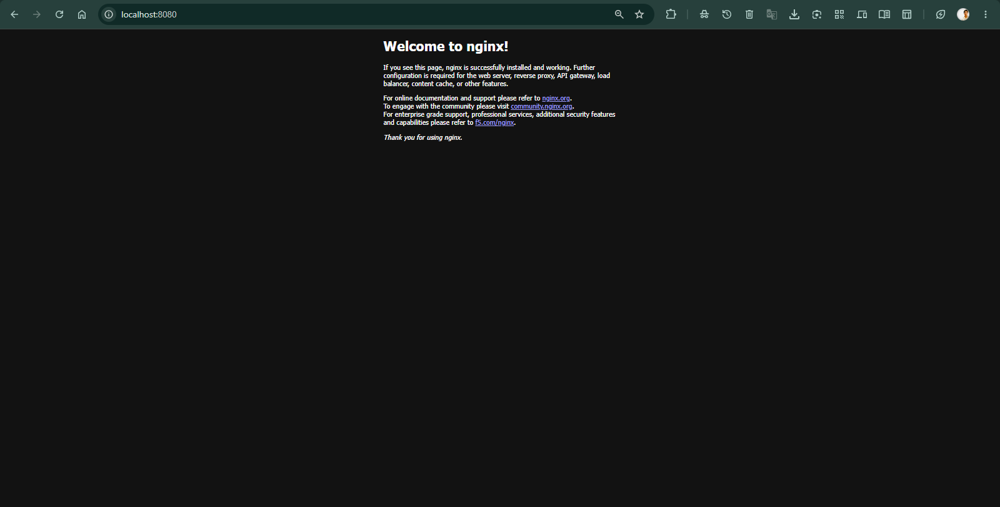

# CodeAlpha DevOps Project

## 📌 Project Overview

This project demonstrates the containerization, deployment, networking, monitoring, and troubleshooting of a full-stack web application using Docker, Docker Compose, and Nginx.

The application consists of:

* **Frontend:** React / Vite
* **Backend:** Node.js / Express
* **Web Server:** Nginx
* **Containerization:** Docker
* **Orchestration:** Docker Compose
* **Networking:** Docker bridge network
* **Health Monitoring:** Docker health checks

---

## 🏗️ Project Architecture

```text
                    Browser
                       │
                       ▼
                ┌─────────────┐
                │    Nginx    │
                │   Frontend  │
                └──────┬──────┘
                       │
                       │ Proxy
                       ▼
                ┌─────────────┐
                │   Backend   │
                │ Node / API  │
                └──────┬──────┘
                       │
                       ▼
                  Application
                   Services
```

---

# 🐳 Docker Implementation

## 1. Nginx Running on localhost

Nginx was configured and verified as a local web server for serving the application.



---


